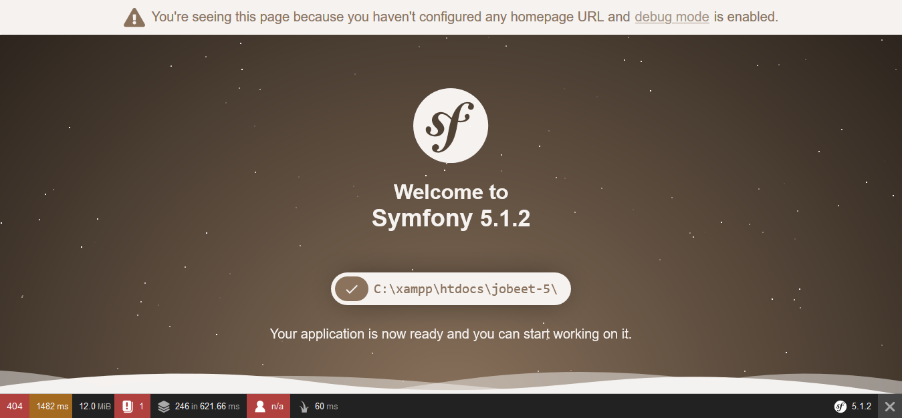

# Jobeet Day 1: Starting up the Project

Setup the development environment, install Symfony 5.1 and display a page of the application in the web browser.
First of all, we need to have a friendly working environment for web development. I will **not use** [Docker][1] with 
nginx and PHP images from [Docker Hub][2].
To check the minimum requirements for running Symfony 5.1 you can access this [link][3].

## My development enviroment
* PHP 7.4.3
* COMPOSER 1.9.3
* XAMPP 3.2.4
* Visual Studio Code

Congratulations! Now you have prepared environment for Jobeet project.

## Download and install Symfony 5.1

To create our Symfony project we will use method described in official [documentation][6].


After that create Symfony project in `tmp` _(temporary)_ folder, copy it to your project folder, exit from container and change permission of files to be able to edit them from your IDE:
```bash
 composer create-project symfony/website-skeleton my_project_name
```
## Linux
```bash

 composer create-project symfony/website-skeleton my_project_name /tmp/jobeet/
cp -aR /tmp/jobeet/. .
exit;
sudo chown -R $USER:$USER .
```

We install into `tmp` directory and copy then to proper one, because `create-project` command requires target folder to be empty, but in project’s folder we already have docker files.

## Config Virtual Host
C:\xampp\apache\conf\extra
```bash
# Jobeet-5

<VirtualHost *:80>
  DocumentRoot "C:/xampp/htdocs/jobeet-5/public"
  ServerName jobeet-5.com
  ServerAlias www.jobeet-5.com
  SetEnvIf Authorization "(.*)" HTTP_AUTHORIZATION=$1
  
  <Directory "C:/xampp/htdocs/jobeet-5/public">
    AllowOverride All
    Order Allow,Deny
    Allow from All

    Require all granted
    FallbackResource /index.php
  </Directory>

</VirtualHost>
```
C:\Windows\System32\drivers\etc
```bash
127.0.0.1         localhost 
127.0.0.1         jobeet-5.com
```

## Test the Symfony installation

Now open your web browser and enter the [http://127.0.0.1][7] URL. You should see error `No route found for "GET /"` but it’s OK. You don’t have any routes created yet.

## Symfony console

Symfony 5 comes with the console component tool that you will use for different tasks. To see a list of things it can do for you type at the command prompt:

```bash
php bin/console list
```


## The Environments

Symfony 5 has different environments. If you look in the project’s directory, you will see file `.env` with variable `APP_ENV=dev` inside.
Value `prod` stands for production environment and `dev` is used by web developers when they work on the application in the development environment.  

The development environment will prove very handy because it will show you all the errors and warnings and the Web Debug Toolbar  —  the developer’s best friend.
Check the development environment by accessing [http://127.0.0.1][7] in your browser (note the bottom debug toolbar).



End of Day 1. You can find the code from this day here: [https://github.com/miaguirre22/jobeet-5/tree/day-1][8].


## Additional information

- [Installing & Setting up the Symfony Framework][10]
- [Overview Compose][12]

## Next Steps

Continue this tutorial here: [Jobeet Day 2: The Project](day-2.md)

Main page is available here: [Symfony 5.1 Jobeet Tutorial](../README.md)

[1]: https://www.docker.com/
[2]: https://hub.docker.com/
[3]: https://symfony.com/doc/current/setup.html#technical-requirements
[4]: https://docs.docker.com/install/linux/docker-ce/ubuntu/
[5]: https://docs.docker.com/compose/install/
[6]: https://symfony.com/doc/current/setup.html
[7]: http://127.0.0.1
[8]: https://github.com/miaguirre22/jobeet-5/tree/day-1
[9]: https://phpdocker.io/generator
[10]: https://symfony.com/doc/current/setup.html
[11]: https://www.docker.com/what-docker
[12]: https://getcomposer.org/
